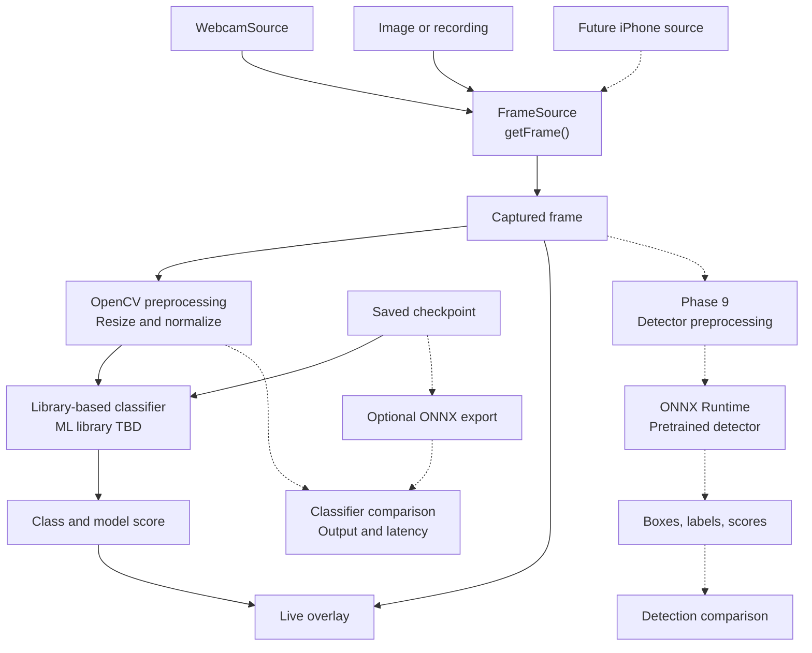

# Live-Vision

A learning-focused C++ project to classify grocery items from images and, eventually, a live camera feed. The developer writes the application and training/inference pipeline using an established ML library. The library provides tensors, layers, automatic differentiation, and optimizers.

## Project Status

Status recorded September 6, 2026. Phase 1 is complete; Phase 2 is next. The ML library remains undecided. There is no working ML model or webcam pipeline yet. The diagrams below describe the intended design.

- [x] Phase 1 — C++ engineering setup and testing
- [ ] Phase 2 — ML foundations and library decision
- [ ] Phase 3 — Learn the selected library in C++
- [ ] Phase 4 — Baseline grocery classifier
- [ ] Phase 5 — CNNs and image classification
- [ ] Phase 6 — Dataset engineering and reproducibility
- [ ] Phase 7 — Train, evaluate, and select the grocery model
- [ ] Phase 8 — Live camera application and pipeline
- [ ] Phase 9 — ONNX Runtime production and detection comparison
- [ ] Phase 10 — Career-fair release and presentation

**Career fair: October 1, 2026.** Target a working Phase 1–8 MVP by September 25, with essential Phase 10 documentation, recording, and release verification finished by September 30. Phase 9 is planned after the fair. Additional polish can continue afterward; future work is not marked in progress until started.

The library-focused [roadmap](roadmap.md) takes precedence over the earlier handwritten Matrix/backpropagation plan. [Schedule and milestones](project-plan.md) · [Architecture and timeline](architecture.md) · [Issues](https://github.com/supernachos57/Live-Vision/issues) · [Milestones](https://github.com/supernachos57/Live-Vision/milestones) · [Repository Projects](https://github.com/supernachos57/Live-Vision/projects)

## Intended architecture



The MVP classifies one prominent grocery item or selected crop, covering a small chosen set of produce and packaged goods. It does not promise multi-object detection. Model scores are not calibrated confidence guarantees. Phase 9 separately explores a pretrained detector and ONNX interchange/inference.

## Build and test

Phase 1 uses C++20, CMake, Ninja, MSYS2 UCRT64/g++, and GoogleTest fetched through CMake. From the repository root in the configured environment:

```sh
cmake -S . -B build
cmake --build build
ctest --test-dir build --output-on-failure
```

The previously reported smoke-test result was 1/1 passed. No new build or ML evaluation is claimed by this documentation update. The future ML dependency may require a deliberate toolchain change, recorded in a decision document.

## Learning and ownership

Learn tensor shapes, loss, gradients, training/evaluation, CNNs, and model assessment while using real library APIs. Implement the C++ data pipeline, model configuration, training orchestration, evaluation, FrameSource adapters, and display behavior personally. Reimplementing tensors or a backpropagation framework is outside scope.

Use small issues and focused pull requests. See the [tracking workflow](docs/project-plan.md#progress-tracking-workflow). Check off a phase only after its exit criteria are verified; this checklist is maintained manually.
