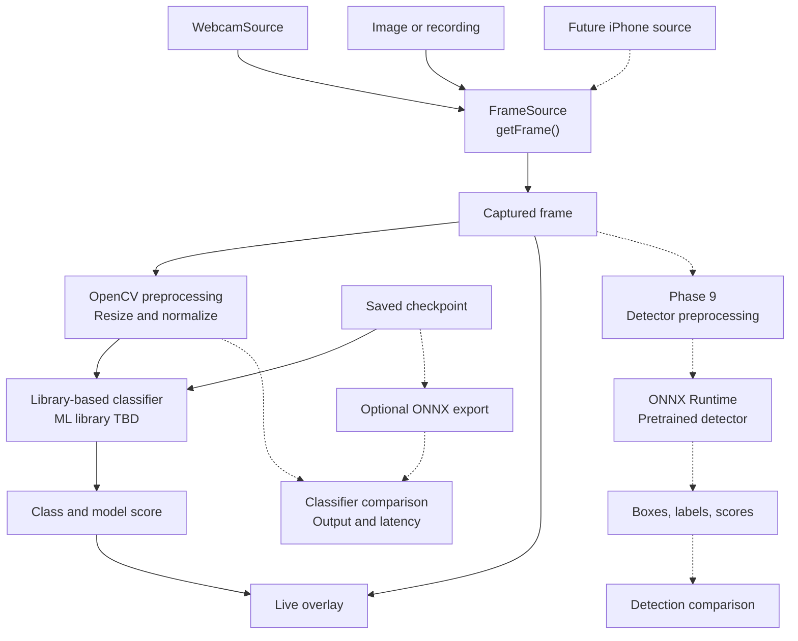
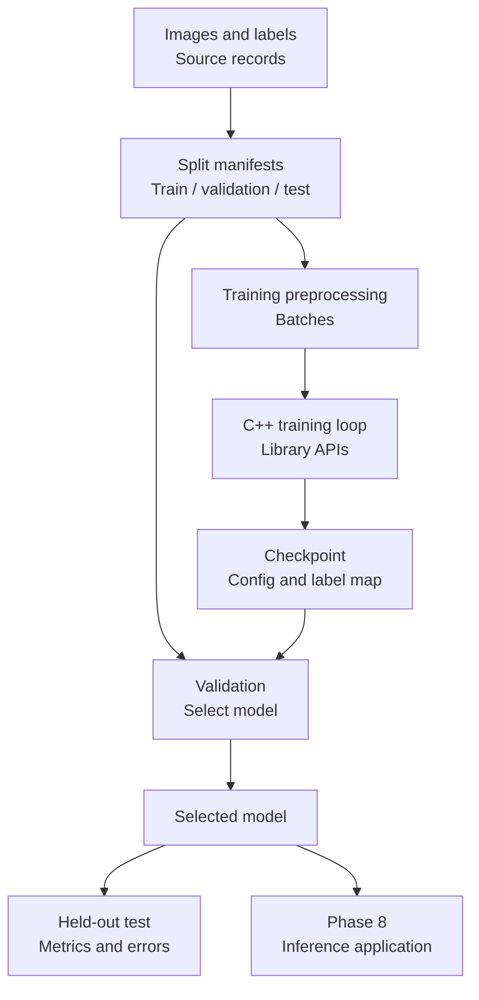
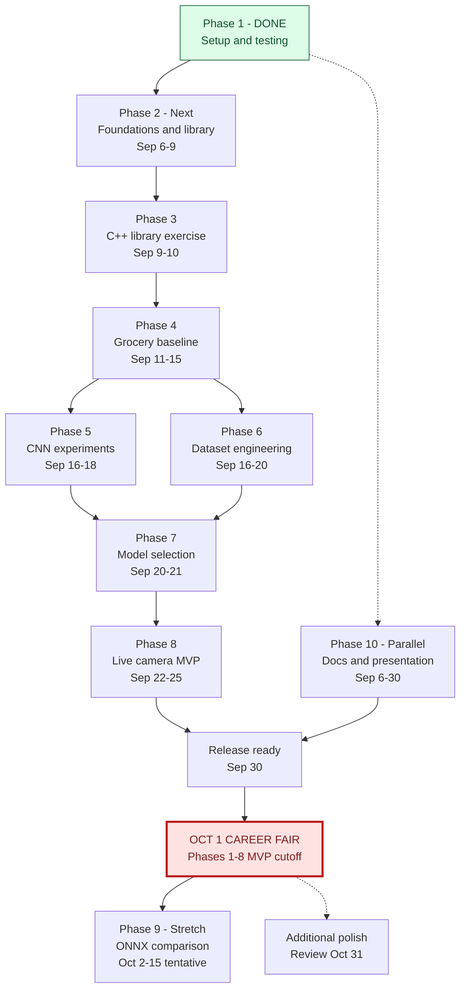

# Planned architecture and timeline

Status: September 6, 2026. Only Phase 1 setup/testing is complete. All runtime components below are planned, not existing code.

## System and data flow

Solid edges describe the intended MVP. Dashed edges describe optional/future paths. FrameSource isolates capture from inference. Its planned getFrame() operation should represent either a frame or an explicit failure/end-of-input condition; decide the exact C++ signature in Phase 8.

WebcamSource is the first live adapter. A still-image or recorded adapter provides repeatable testing and a venue fallback. A possible iPhone source shares the interface but is outside the MVP commitment.

Keep the raw frame for overlays. Document the classifier's crop, input size, color order, value range, tensor layout, and label mapping. Use the same preprocessing contract for training and inference. Detector preprocessing is separate because a pretrained model may require different inputs. Postprocessing may include box decoding and suppression if required by that model.

The developer owns the C++ application, library-based model definition, training loop orchestration, evaluation, and integration. The ML library owns tensor storage/operations, layer implementations, autograd, and optimizer machinery. No handwritten Matrix or NN engine is planned.

## Training and saved-model handoff

Validation guides selection; the held-out test set does not guide tuning. Learn gradient concepts with worked examples and the library's automatic differentiation, not a custom differentiation engine.

## Roadmap timeline

All dates are 2026 planning targets. The vertical timeline keeps labels readable on narrow pages. Phase 1 is confirmed complete; its historical duration is not shown. Phase 2 is next but is not marked active before work starts. Phase 6 quality checks begin during Phase 4; its named window formalizes them. Phase 10 overlaps the learning work rather than depending on Phase 9.

Phase 8's internal target is September 25. **October 1 is the hard Phase 1–8 MVP cutoff**, leaving time for release preparation. Phase 9's October 15 date is tentative. October 31 is a review date for additional polish, not another phase or a required completion claim.

See [project plan](project-plan.md) for milestone definitions, exit criteria, and progress rules. Keep these dates synchronized when revising the plan.
