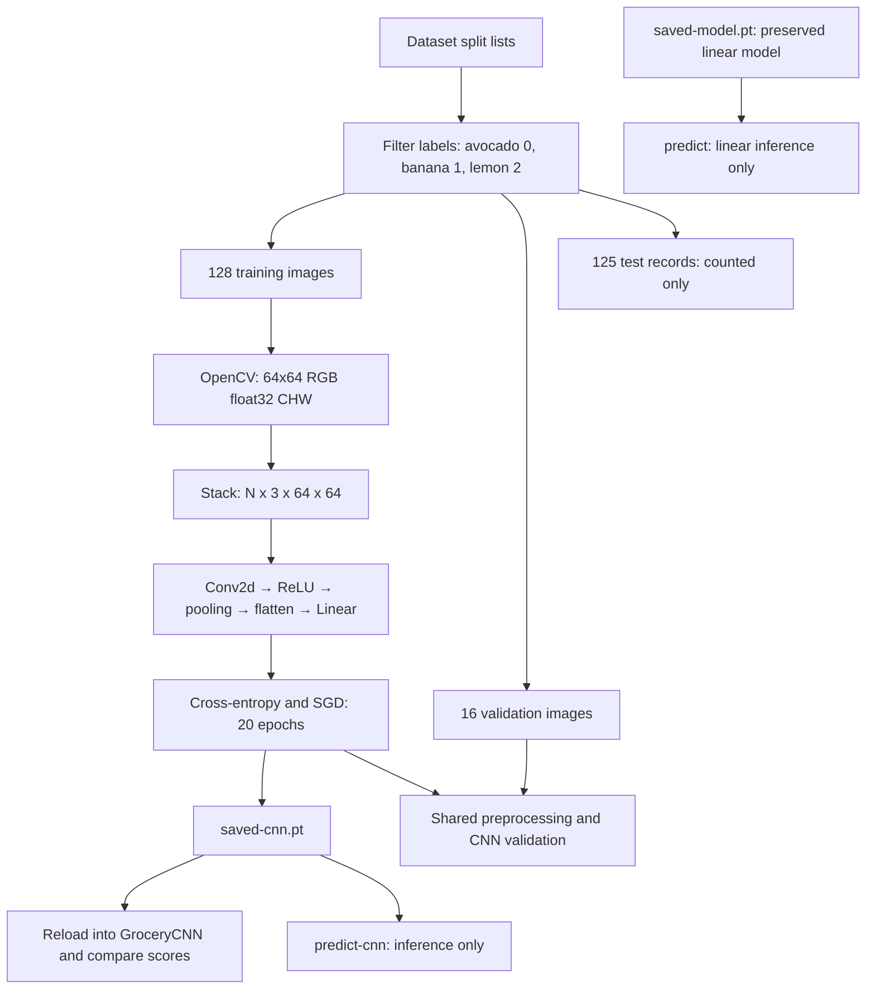

# Architecture and implementation status

Updated September 27, 2026. Phases 1–5 checkpoints are complete. The CPU still-image classifier, training, and prediction paths are implemented in src/main.cpp. Camera capture remains future work.

## Implemented data flow

`GroceryCNN` registers Conv2d(3,8,3), stride 1/padding 1; MaxPool2d(2), stride 2; and Linear(8192,3). Forward produces [N,8,64,64] feature maps, applies ReLU, pools to [N,8,32,32], flattens to [N,8192], and returns [N,3] logits. It has 24,803 trainable parameters. ReLU and pooling have no learned parameters.

`GroceryClassifier` preserves the Phase 4 Linear(12288,3) architecture for baseline prediction. Both paths share `loadImageTensor`, which decodes BGR, resizes, converts to RGB, clones pixels for ownership, scales to float32 [0,1], and rearranges to contiguous CHW. Linear inference flattens before forward; CNN inference does not.

## Command behavior

| Command | Behavior |
| --- | --- |
| No arguments | Train fresh CNN, validate, overwrite saved-cnn.pt, verify reload parity, run historical scalar exercise |
| cnn-check | Inspect random-input shapes and CNN parameters; exit before training |
| predict-cnn image-path | Load saved-cnn.pt into GroceryCNN, preprocess one image, print predicted class, exit |
| predict image-path | Load preserved saved-model.pt into GroceryClassifier and predict |

Paths to dataset lists and checkpoints assume execution from the repository root. Image paths may be absolute or relative. Prediction uses evaluation mode and NoGradGuard. Invalid arguments return failure; prediction exceptions are caught. Training error handling remains basic.

The checkpoint contains registered model state. Architecture, labels, and preprocessing remain in code; optimizer state and metadata are not packaged. Reload uses the matching architecture. No resume-training or best-checkpoint selection exists.

## Verification and limitations

The CNN diagnostic, training/validation, reload parity, and CNN prediction were verified; build and smoke test passed. CNN validation was 8/16, versus the retained linear model's 10/16. See [Phase 5 results](phase-5-results.md) and [Phase 4 results](phase-4-results.md). This is image classification, not object localization or unknown-category rejection. Training is unseeded; test images remain unevaluated.

## Remaining work and schedule

Phase 6 covers dataset quality, split/related-capture auditing, preprocessing contracts, and reproducibility. Phase 7 covers stronger metrics and selection before held-out testing. Phase 8 adds camera input and fallback behavior. Phase 9 remains optional ONNX/detection comparison; Phase 10 covers release reliability and presentation.

On September 27, 2026 the user agreed to target Phase 6 completion that day and begin Phase 7 afterward. Neither phase is complete. The career fair remains October 1. Historical Phase 4/5 targets were September 18/19; Phase 5 closed out September 27.
