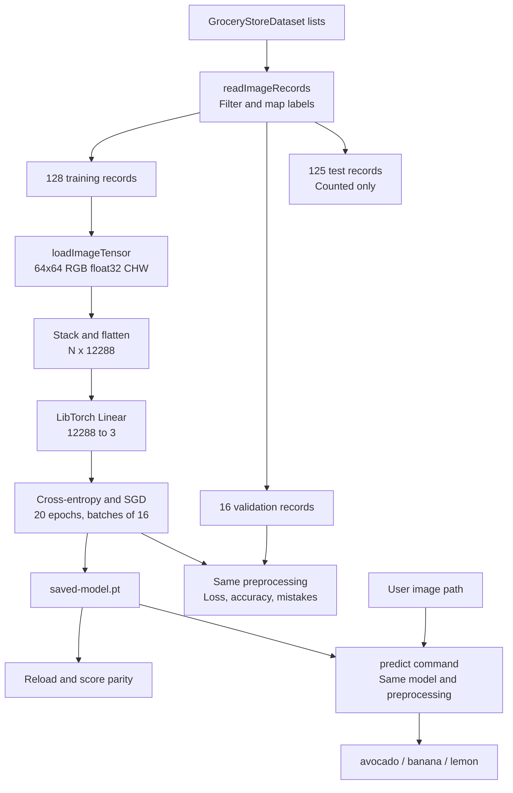

# Architecture and implementation status

Updated September 23, 2026. The implemented application is a CPU still-image grocery classifier in `src/main.cpp`. Phases 1–4 checkpoints are complete; CNNs and live capture are future work.

## Implemented data flow

`ImageRecord` contains an image path and int64 label. `GroceryClassifier` registers one Linear layer. `loadImageTensor` owns the returned tensor pixels through cloning; `readImageRecords` retains separate split collections. These functions and the orchestration remain together in main.cpp for the learning exercise.

The no-argument branch trains a new model, evaluates validation data, overwrites the checkpoint, verifies reload parity, and then runs the historical scalar exercise. The `predict <image-path>` branch loads the saved state and returns before training. Prediction exceptions produce an error and nonzero exit. Paths currently assume execution from the repository root for dataset lists and the checkpoint.

The checkpoint contains registered model state. Architecture dimensions, preprocessing, class names, and configuration are currently supplied in C++ and documented in [Phase 4 results](phase-4-results.md); they are not packaged as checkpoint metadata. No optimizer-resume path exists.

## Planned extensions

- Phase 5: replace/compare the linear model with a small CNN.
- Phase 6: validate dataset quality, related captures, split overlap, preprocessing contracts, and reproducibility.
- Phase 7: stronger metrics and final model selection, using validation for decisions and held-out testing afterward.
- Phase 8: camera capture, preprocessing, inference display, graceful shutdown, timing, and fallback input. A FrameSource-style interface is a planned design, not implemented code.
- Phase 9: optional ONNX inference/interchange and a separate pretrained detection comparison.
- Phase 10: demo reliability, presentation, recording, and release preparation.

The developer owns model definition and pipeline orchestration; LibTorch supplies tensor operations, layers, autograd, and optimizers, while OpenCV supplies image decoding and transformations. The current application classifies an entire image and does not locate objects or reject unknown categories.

## Schedule status

Agreed Phase 4/5/6 targets: September 18/19/20, 2026. Phase 4 implementation was verified September 22 and documented September 23. These targets have passed; no replacement dates are agreed. October 1 remains the career-fair date. See [project plan](project-plan.md) for the historical schedule and explicit revisions.
